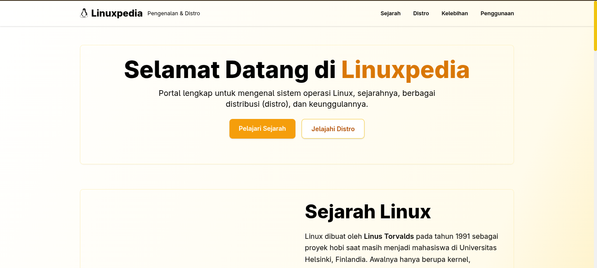

<div align="center">
  
</div>

# 🌐 Web Introduce Linux

Website ini dibuat menggunakan **TailwindCSS** sebagai framework CSS utama dan dirancang untuk menjadi platform edukasi pengenalan dasar tentang Linux — mulai dari apa itu Linux, sejarahnya, perintah terminal dasar, distro populer, hingga cara instalasi.

Website ini sepenuhnya **open-source** dan dapat diakses langsung melalui GitHub Pages.

---

## 🚀 Live Demo

🔗 **Website:** https://rivetchan.github.io/Web-Introduce-Linux/

---

## 🛠️ Teknologi yang Digunakan

| Teknologi | Fungsi |
|----------|--------|
| **HTML** | Struktur halaman |
| **TailwindCSS** | Styling berbasis utility class |
| **Node.js + npm** | Build environment |
| **GitHub Pages** | Deployment dan hosting |

---

## 📦 Instalasi dan Setup Development

Jika ingin menjalankan project ini secara lokal:

### 1. Clone Repository
```bash
git clone https://github.com/USERNAME/Web-Introduce-Linux.git
cd Web-Introduce-Linux
